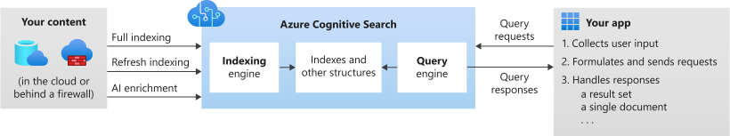

# AZ-204: Developing Solutions for Microsoft Azure - Exam Prep Notes

 <a href="..\README.MD">Index</a> | <a href="..\RESOURCES.MD">Resources</a> 

----
[Azure (Cognative) Search](https://docs.microsoft.com/en-us/azure/search/search-what-is-azure-search)
-----------------
### General

**Overview**

A 16-min video which highlights the main features of Azure Cognative Search.

* PaaS Search Service (integrated into applications)
* Features:
  * Keyword Search
  * Faceting/Filters
  * Language Analysers
  * Geospatial Support
  * Suggestions/Auto-complete
  * Proximity Search
  * Synonyms
  * Cognitive Skills

### Tech Tips
[**Indexing data using Azure Search .NET SDK**](https://docs.microsoft.com/en-us/azure/search/search-howto-dotnet-sdk)
1. Create `SearchIndexClient` object (used to create, update or delete indexes)
2. Upload batch data into index using the `IndexDocumentsBatch.Create(IndexDocumentsAction.Upload())` objects and methods
3. Call the `SearchClient.IndexDocuments(batch)` method and pass in the batch object.

### High Availability / Scalability

### Notable Limits**

### Labs
