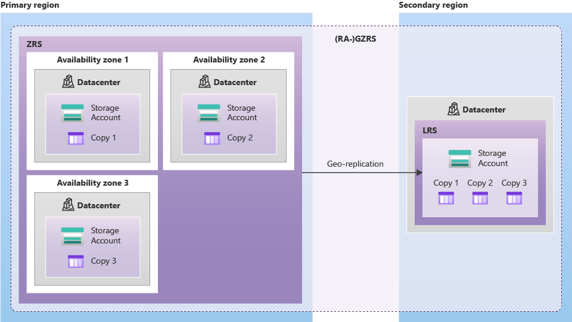

# AZ-204: Developing Solutions for Microsoft Azure - Exam Prep Notes

<div style="text-align: right"> <a href="..\README.MD">Index</a> | <a href="..\RESOURCES.MD">Resources</a> </div>

----
[Azure Storage](https://docs.microsoft.com/en-us/azure/storage/common/storage-account-overview)
-----------------
### General
**Storage Types**
* Blob Storage
  * Page
  * Append
  * Block
* [Table Storage](https://docs.microsoft.com/en-us/azure/storage/tables/table-storage-overview)
  * NoSQL datastore.
  * Ideal for structured, non-relational data.
  * **Common uses**
    * Storing TBs of structured data capable of serving web scale applications.
    * Storing datasets that don't require complex joins, foreign keys, or stored procedures and can be denormalized for fast access.
    * Quickly querying data using a clustered index.
    * Accessing data using the OData protocol and LINQ queries with WCF Data Service .NET Libraries. 
  * [Query performance and design](https://docs.microsoft.com/en-us/azure/storage/tables/table-storage-design-for-query)
    * You cannot add indexes to Tables like with RDBMS to address performance issues.
    * It's important to design tables correctly up gront becuase it's difficult and expensive to change it at a later stage.
    * **Query types**

      |  | **Point Query** | **Range Query** | **Partition Scan** | **Table Scan** |
      |---|---|---|---|---|
      | Efficiency | Most efficient | Second best | Third best | Least efficient |
      | Detail | Locates an individual entity by specifying `PartitionKey` and `RowKey` | Returns more than one entity in a partition. `RowKey` range defines a subset of entities in the partition specified by `PartitionKey`. | Filters on `PartitionKey` and another non-key property that may return more than one entity. | Searches all the partitions that make up the table. It will perform a table scan regardless of whether or not your filter uses the `RowKey`. |
      | Example | `$filter=(PartitionKey eq 'Sales') and (RowKey eq '2')` | `$filter=PartitionKey eq 'Sales' and RowKey ge 'S' and RowKey lt 'T'`  | `$filter=PartitionionKey eq 'Sales' and LastName eq 'Smith'` | `$filter=LastName eq 'Jones'` |
    
* File Storage
  * Network attached storage
* Queue Storage
  * 64kB limit per message.
  * Less robust than [Service Bus queues](../servicebus/README.MD).
  * Queue size limited to storage account capacity.


### Tech Tips
**Blobs**
* You can check the [Change Feed](https://docs.microsoft.com/en-us/azure/storage/blobs/storage-blob-change-feed?tabs=azure-portal#what-is-the-difference-between-change-feed-and-storage-analytics-logging) for Blob metadata and to evaluate any changes to the Blob store over time.


**Queues**
* [Queue trigger for Functions](https://docs.microsoft.com/en-us/azure/azure-functions/functions-bindings-storage-queue#hostjson-settings)
  * Default Max Dequeue count is 5 (then moved to poision/dead-letter queue)
  * Will allow for batch processing of 16 messages in parallel by Function
  
**Tables**
* When querying a table with filters, if the filter property is not related to the `PartionKey`, a table scan is performed and the results are filtered once retrieved by the client.

  
### High Availability / Scalability

**LRS - Locally Redundant Storage**


**GRS - Geo-Redundant Storage (and Read Access GRS)**


**ZRS - Zone Redundant Storage**


**GZRS - Geo-Zone Redundant Storage**


### Notable Limits**
* Max of 5 PiB per storage account.
* Max blob size is 4.75 Terabytes.
* Blob storage limitation is 20000 IOPS (if throughput is > limit, consider creating additional account(s)).

### Labs

**Skills Measured in Examination**
Source: Exam AZ-204: Developing Solutions for Microsoft Azure - Skills Measured (updated March 26 2021)

```
Develop solutions that use blob storage
- move items in Blob storage between storage accounts or containers
- set and retrieve properties and metadata
- perform operations on data by using the appropriate SDK
- implement storage policies, and data archiving and retention

Implement user authentication and authorization
-create and implement shared access signatures
```

**Relevant Tutorials**

### Related Services
[Azure VM](../azurevm/README.MD) | [Azure Service Bus](../servicebus/README.MD) | [Azure Functions](../functions/README.MD) | [Azure AD](../azuread/README.MD) | [Azure Key Vault](../keyvault/README.MD) | [Azure Event Grid](./../eventgrid/README.MD)